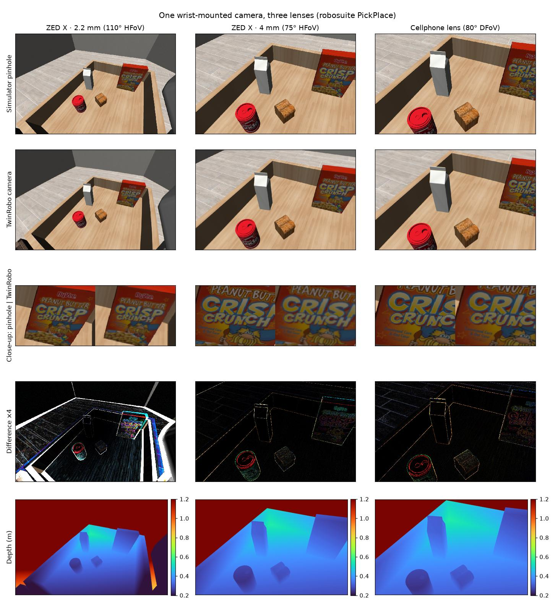

# Get started

## Install

TwinRobo needs **Python 3.12** (inherited from DeepLens) and a CUDA GPU for
practical speeds.

```bash
git clone https://github.com/TwinRobo/TwinRobo-Core.git && cd TwinRobo-Core
conda create -n twinrobo python=3.12 -y && conda activate twinrobo
pip install -e ".[dev]"          # core + DeepLens
pip install -e ".[libero]"       # + MuJoCo, NVIDIA Warp and LIBERO support
```

!!! note "Other simulators"
    LIBERO itself is used from a checkout (`LIBERO_ROOT`). RoboCasa needs
    robosuite 1.5 and gets its own environment ([details](simulators.md#robocasa)).
    Isaac Sim runs in NVIDIA's container, with TwinRobo on Isaac's own Python and
    torch ([details](simulators.md#running-in-docker)):

    ```bash
    docker pull nvcr.io/nvidia/isaac-sim:6.1.0        # needs the NVIDIA Container Toolkit
    docker/isaac/run.sh examples/01_isaac_camera.py   # builds the image on first use
    ```

## Mount a real camera on a robot

Pick a camera from the catalog, mount it on a robot link, and render what it
would record, here in robosuite's PickPlace scene (`pip install -e ".[libero]"`
brings robosuite; no LIBERO checkout needed):

```python
import robosuite

from twinrobo import CameraSpec, CameraTwin, CatalogRegistry
from twinrobo.plugins.mujoco import MujocoCameraTwin, RobosuiteRenderer, to_uint8
from twinrobo.plugins.mujoco.mounts import CameraMount, mounted

env = robosuite.make(
    "PickPlace",
    robots="Panda",
    has_renderer=False,
    has_offscreen_renderer=True,
    use_camera_obs=False,
)
env.reset()

# 1. Pick a real camera from the catalog (here read out at 960x600).
path = CatalogRegistry().resolve("stereolabs/zed-x/2.2mm")
twin = CameraTwin.from_spec(CameraSpec.from_yaml(path, width=960, height=600))

# 2. Mount it on a robot link: position (m) and yaw/pitch/roll (deg) in the link's frame.
wrist = CameraMount("wrist", body="robot0_right_hand", pos=(0.08, 0, 0), rpy_deg=(67, -48, 173))

# 3. Render what that camera would record.
with mounted(env.sim.model._model, env.sim.data._data, wrist) as host:
    frame = MujocoCameraTwin(twin, RobosuiteRenderer(env), camera=host).get_frame(force_depth=True)

image = to_uint8(frame.rgb)          # the real camera's image, uint8 [H, W, 3]
pinhole = to_uint8(frame.rgb_ideal)  # the simulator's ideal pinhole, same camera
depth = frame.depth[0, 0]            # ground-truth z-depth (m): a label, the ZED X outputs none
```

The first call builds the lens's PSF bank with DeepLens (about 20 s on a GPU)
and caches it; after that a frame takes a fraction of a second. The mount moves
with the link, so it follows the robot as it acts or replays a demo.

`examples/05_mount_camera_on_robot.py` does this for three catalog cameras on
the same wrist mount:

```bash
MUJOCO_GL=egl python examples/05_mount_camera_on_robot.py   # writes outputs/05_mount_camera.jpg
```



- **Simulator pinhole / TwinRobo camera:** each lens's own field of view. The
  ZED X 2.2 mm's wide lens shows its barrel distortion, which a pinhole cannot.
- **Close-up:** the same patch at native resolution; the real lens softens the
  lettering, as the camera would.
- **Difference ×4:** where the optics change the image.
- **Ground-truth depth:** the simulator's metric z-depth, aligned pixel for pixel with the
  camera's image; a label for training, not an output of the camera (`force_depth=True`).

## Next steps

<div class="grid cards" markdown>

-   :material-ray-start-arrow: __Trace real lens rays__

    Pass `render="pupil"` or `render="raycast"` to `MujocoCameraTwin`.
    [Rendering methods](rendering.md#rendering-methods)

-   :material-cube-outline: __Isaac Sim__

    The same twin on any USD camera prim, with all three methods.
    [Isaac Sim](simulators.md#isaac-sim)

-   :material-robot: __A LIBERO policy's camera__

    `CameraTwinLiberoEnv` swaps observations in place; eval scripts run
    unchanged. [LIBERO](simulators.md#libero)

-   :material-camera-plus: __Your own camera__

    Copy a catalog spec, or add one for everyone.
    [Cameras](cameras.md) · [Contributing](contributing.md#adding-a-camera)

</div>
