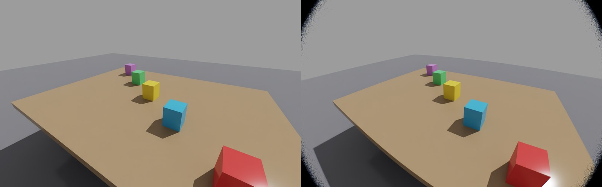

<div class="tr-hero" markdown>

<div class="tr-badges"><span>AGPL-3.0 · commercial</span><span>Python 3.12</span><span>MuJoCo · Isaac Sim</span><span>alpha</span></div>

# See through the camera <span class="tr-grad">you will deploy</span>

<p class="tr-lead">Simulators render through a perfect pinhole; robots see through real lenses.
TwinRobo renders simulated scenes through the actual optics of off-the-shelf cameras,
so perception trained in simulation meets the same image on the robot.</p>

[Get started](getting-started.md){ .md-button .md-button--primary }
[Browse cameras](catalog.md){ .md-button }



<p class="tr-caption">Isaac Sim, left: the simulator's pinhole. Right: a Stereolabs ZED X 2.2 mm, every pixel ray-traced through its lens.</p>

</div>

## One environment, any real camera

<div class="grid cards tr-2col" markdown>

-   :material-camera-iris:{ .lg .middle } __Real lens optics__

    ---

    Lenses traced with DeepLens: depth- and field-dependent blur, the lens' own
    distortion, chromatic aberration and vignetting, from a prescription, not a
    hand-tuned filter.

    [:octicons-arrow-right-24: Optics and rendering](rendering.md)

-   :material-ray-start-arrow:{ .lg .middle } __Three rendering methods__

    ---

    A fast 2.5D PSF renderer, plus lens-ray renderers that trace every pixel's
    rays through the lens into the scene, exact even around defocused
    foreground objects.

    [:octicons-arrow-right-24: Rendering methods](rendering.md#rendering-methods)

-   :material-robot-industrial:{ .lg .middle } __Drop-in for simulators__

    ---

    MuJoCo, LIBERO, RoboCasa and NVIDIA Isaac Sim. Wrap a camera and policies,
    eval scripts and recorded demos run unchanged, now through a real camera.

    [:octicons-arrow-right-24: Simulators](simulators.md)

-   :material-view-grid-plus:{ .lg .middle } __An open camera catalog__

    ---

    RealSense, ZED, OAK-D, a C920 webcam and the Raspberry Pi camera, as single
    cameras or rectified stereo pairs. Every camera works in every simulator and
    method, and a real unit can be [calibrated](calibration.md).

    [:octicons-arrow-right-24: Camera catalog](catalog.md)

</div>

## Support at a glance

| | MuJoCo (incl. LIBERO, RoboCasa) | NVIDIA Isaac Sim 6.x |
|---|---|---|
| Adapter | `MujocoCameraTwin` | `IsaacCameraTwin` |
| `psf`: pinhole + lens blur and distortion | :material-check-bold: | :material-check-bold: |
| `pupil`: lens rays across the aperture | :material-check-bold: | :material-check-bold: |
| `raycast`: lens rays cast into the scene | :material-check-bold: | :material-check-bold: |
| RGB + metric depth, on the GPU | :material-check-bold: | :material-check-bold: |
| Cameras on robot links, stereo modules | :material-check-bold: | any USD camera prim |
| Setup | `pip install` | Docker recipe included |

## Five lines to a real camera

=== "MuJoCo"

    ```python
    from twinrobo import CameraTwin
    from twinrobo.plugins.mujoco import MujocoCameraTwin, MujocoRenderer

    twin = CameraTwin.from_catalog("stereolabs/zed-x/2.2mm")
    cam = MujocoCameraTwin(twin, MujocoRenderer(model, data), camera="wrist")
    frame = cam.get_frame()          # frame.rgb, frame.depth, on the GPU
    ```

=== "Isaac Sim"

    ```python
    from twinrobo import CameraTwin
    from twinrobo.plugins.isaac import IsaacCameraTwin

    twin = CameraTwin.from_catalog("stereolabs/zed-x/2.2mm", build_psf=False)
    cam = IsaacCameraTwin(twin, "/World/Camera", render="raycast")
    frame = cam.get_frame()          # every pixel ray-traced through the lens
    ```

=== "LIBERO"

    ```python
    from twinrobo import CameraTwin
    from twinrobo.datasets.libero import CameraTwinLiberoEnv, make_env

    env, task, init_states = make_env("libero_spatial", 0, resolution=128)
    env = CameraTwinLiberoEnv(env, {"agentview": CameraTwin.from_catalog("stereolabs/zed-x/4mm")})
    obs = env.reset()                # obs["agentview_image"] now comes from the twin
    ```

=== "Any RGB-D"

    ```python
    from twinrobo import CameraTwin

    twin = CameraTwin.from_catalog("stereolabs/zed-x/2.2mm")
    frame = twin.process(rgb, depth) # linear RGB [B,3,H,W] + metric depth [B,1,H,W]
    ```

## Validated in both simulators

<div class="grid cards tr-stats" markdown>

-   __46 dB__

    PSF renderer vs DeepLens' reference renderer at 1920×1200.

-   __< 0.1 px__

    Points land where the lens' chief rays point (Isaac Sim).

-   __~0.03 vs ~0.13__

    Error on a defocused foreground edge: ray cast vs pinhole + PSF (Isaac Sim;
    MuJoCo ~0.05).

</div>

<div class="tr-cta" markdown>

### :material-camera-plus: Your camera is missing? Add it

The catalog is the heart of TwinRobo, and it is open. A camera is a
`camera.yaml` and a lens file; once merged it works in every simulator,
rendering method and dataset replay, for everyone.

[How to add a camera](contributing.md#adding-a-camera){ .md-button .md-button--primary }
[Request a camera](https://github.com/TwinRobo/TwinRobo-Core/issues/new?template=new_camera.md){ .md-button }

</div>

<div class="tr-cta" markdown>

### :material-handshake: Camera makers: become a partner

Robot teams now choose and validate cameras in simulation. Ship
`manufacturer_verified` models of your products, get listed as a partner and
showcased, or sponsor the open environment your customers use.

[The partner program](partners.md){ .md-button .md-button--primary }

</div>
