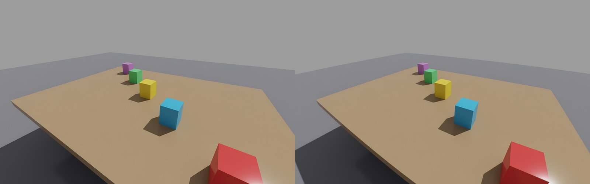

# Simulators

| Simulator | Scenes and data | Status |
|---|---|---|
| MuJoCo | any MJCF model; `mujoco.Renderer` or robosuite backends | supported |
| LIBERO (robosuite 1.4) | LIBERO tasks and HDF5 demo datasets, 9 robot options | supported |
| RoboCasa (robosuite 1.5) | procedurally generated kitchens, LeRobot demo datasets | supported |
| Isaac Sim 6.x | any USD stage, RTX rendering | supported: `psf`, `pupil`, `raycast` |

## MuJoCo

`twinrobo.plugins.mujoco` renders a MuJoCo camera at the twin's resolution and
paraxial FoV, from the same camera pose, with metric depth, and runs the
TwinRobo pipeline. `MujocoCameraTwin(twin, backend, camera=...)` works with
`MujocoRenderer(model, data)` for plain MuJoCo and `RobosuiteRenderer(env)`
inside robosuite (a second `mujoco.Renderer` in a robosuite process corrupts
robosuite's renders).

## LIBERO

```bash
pip install -e ".[libero]"
export LIBERO_ROOT=/path/to/LIBERO                 # checkout containing libero/libero
export LIBERO_CONFIG_PATH=/dir/with/libero/config  # avoids LIBERO's stdin prompt
export MUJOCO_GL=egl
```

```python
from twinrobo import CameraTwin
from twinrobo.datasets.libero import CameraTwinLiberoEnv, make_env

env, task, init_states = make_env("libero_spatial", 0, resolution=128)
twin = CameraTwin.from_catalog("stereolabs/zed-x/2.2mm")
env = CameraTwinLiberoEnv(env, {"agentview": twin})
env.seed(0)
env.reset()
obs = env.set_init_state(init_states[0])  # obs["agentview_image"] comes from the twin
```

- **Online:** `CameraTwinLiberoEnv` replaces `obs[f"{camera}_image"]`, keeping
  its shape, dtype and image convention, so eval scripts and policies run
  unchanged.
- **Replay:** demos replay from their recorded states
  (`twinrobo.datasets.libero.replay`), so any camera can be placed in a recorded
  episode.
- **Geometry:** the twin's frame is center-cropped to the observation's aspect
  ratio and area-resized. `match_fov=False` keeps LIBERO's FoV and applies only
  the optics.
- **Robots:** besides the Franka Panda, robosuite's Sawyer, UR5e, KUKA iiwa,
  Kinova Jaco and Kinova Gen3 are registered for LIBERO scenes
  (`twinrobo.datasets.libero.robots`, LIBERO unmodified). Multi-camera variants of the
  Panda, UR5e and Gen3 carry a ZED X Mini stereo module at the wrist and an
  over-the-shoulder camera; cameras add no joints, so a variant replays its
  base arm's demos.
- **Exact replay:** LIBERO randomizes the poses of its jointless fixtures
  (cabinet, stove, ...) per episode, outside the recorded state. TwinRobo
  applies each episode's fixture poses from its model XML, which raised
  replay-vs-stored-image PSNR from about 26 to about 35 dB.

Measured on `libero_spatial` task 0, RTX 3090, example spec at 1920x1200:

| | |
|---|---|
| Step time (wrapped, agentview only) | about 300-340 ms (render ~15 ms, optics the rest) |
| Identity twin at LIBERO FoV/res vs original obs | exact (at most 1/255, sRGB round trip) |
| Optics effect at 128 / 256 / 512 px (ideal vs twin, same FoV) | 43 / 39.6 / 36.5 dB |

At LIBERO's 128 px, a sharp lens's 2-3 px blur at 1920x1200 is mostly
downsampled away and the camera's geometry dominates. Optics matter at higher
policy resolutions, with blurrier lenses or close focus.

## RoboCasa

RoboCasa brings realistic scenes: procedurally assembled kitchens with textured
fixtures, appliances and Objaverse objects, and human demos of the PandaOmron
mobile manipulator. Each episode stores its generated kitchen
(`model.xml.gz`) and its simulator states, so it is replayed exactly: 35-37 dB
against the recorded (H.264) videos.

RoboCasa needs robosuite 1.5 and LIBERO needs 1.4.1, so each gets its own
environment:

```bash
conda create -n twinrobo-robocasa python=3.12 -y
conda activate twinrobo-robocasa
pip install -e ".[dev]"
pip install "numpy==2.2.5" "numba==0.61.2" "scipy==1.15.3" "mujoco==3.3.1" \
    warp-lang pyarrow h5py matplotlib "imageio[ffmpeg]"
pip install --no-deps "robosuite @ git+https://github.com/ARISE-Initiative/robosuite@5ce6643f" \
    "robocasa @ git+https://github.com/robocasa/robocasa@4f8a2980"
export ROBOCASA_ASSETS=<robocasa asset pack>   # objects/, textures/, fixtures/, ...
```

The asset pack is linked into the installed package; the pack is not modified.

```python
from twinrobo.datasets.robocasa import env_args, make_env, read_episode, reset_to_episode, setup_robocasa

setup_robocasa()  # checks robosuite 1.5, links $ROBOCASA_ASSETS
env = make_env(env_args(dataset_dir))  # a LeRobot dataset dir (meta/, extras/)
states, kitchen_xml, ep_meta = read_episode(dataset_dir, "episode_000000")
reset_to_episode(env, kitchen_xml, ep_meta)  # the episode's own kitchen
env.sim.set_state_from_flattened(states[t])  # then render any camera at frame t
```

- Loading an episode takes about 10 s: every episode has its own kitchen.
  Frames within an episode are fast.
- Ray cast costs about 2.2 s per 1920x1200 frame in a kitchen (570k
  triangles); pupil raster costs the same as in LIBERO.
- Robot: PandaOmron, the robot the demos were recorded with.

## Isaac Sim



`twinrobo.plugins.isaac.IsaacCameraTwin` renders a USD camera's view through a twin,
with the same interface as the MuJoCo adapter:

```python
from twinrobo import CameraTwin
from twinrobo.plugins.isaac import IsaacCameraTwin

twin = CameraTwin.from_catalog("stereolabs/zed-x/2.2mm")
cam = IsaacCameraTwin(twin, "/World/Camera")  # any UsdGeom.Camera prim
frame = cam.get_frame()                       # renders, then runs the optics
frame.rgb                                     # linear RGB on the GPU (force_depth=True for depth)
cam.close()                                   # removes what it added to the stage
```

- **Non-invasive:** your camera is not changed. The adapter adds a child camera
  (`<camera>/TwinRoboView`) with the twin's intrinsics (focal length over
  aperture = fx over width) and a Replicator render product with `rgb` and
  `distance_to_image_plane` annotators. `match_fov=False` keeps your camera's
  own lens and applies only the optics.
- **GPU end to end:** annotator data is read as Warp arrays and viewed as torch
  tensors without a copy; depth is converted from stage units to meters.
- **Rendering:** `get_frame()` renders a frame with
  `rep.orchestrator.step` (the timeline is not advanced). In your own loop,
  after `world.step(render=True)`, call `get_frame(step=False)`.
  `rt_subframes` trades speed for less RTX ghosting after large motions.
- **Near clip:** USD's default near clip is 1 scene unit, 1 m on a meter stage,
  which hides what a robot camera sees up close; the view uses
  `near_clip_m=0.01` instead.
- **Lens-ray methods:** `render="pupil"` or `render="raycast"` trace every
  pixel's rays through the real lens, as in MuJoCo:

  ```python
  twin = CameraTwin.from_catalog("stereolabs/zed-x/2.2mm", build_psf=False)
  cam = IsaacCameraTwin(twin, "/World/Camera", render="raycast")
  ```

  The pupil views are child cameras (`<camera>/TwinRoboPupil<i>`) shifted across
  the lens' entrance pupil; they render in the same Replicator step as the main
  view. Ray cast intersects every ray with the stage's triangles: every visible
  mesh, cube, sphere, cylinder, capsule, cone and plane (instance proxies
  included), posed each frame from USD and converted to meters, in one NVIDIA
  Warp BVH. `build_psf=False` skips the PSF bank, which only `psf` uses.
- **Tested** (`tests/plugins/isaac/`):
  - `psf`: a marker lands within 1 px of the pixel the twin's intrinsics
    predict; depth is metric (the wall 2.99 m away, an object 30 cm away);
    `match_fov=False` keeps the camera's lens; `close()` leaves the stage as it
    was.
  - `raycast` and `pupil`: a marker lands within 0.1 px of where the lens' chief
    ray points (a paraxial pinhole would put it ~5 px away).
  - `raycast`: the blurred edges of a 6 mm post 0.3 m away (the lens focused at
    3 m) match the exact coverage computed from the traced rays to ~0.03;
    pinhole + PSF errs by ~0.13.

### Running in Docker

Isaac Sim ships its own Python 3.12 and torch (2.11 in 6.1), and DeepLens pins
torch 2.10, so a plain `pip install` would pull a second torch. The image in
`docker/isaac/` installs DeepLens without dependencies on Isaac's torch (tested
with Isaac Sim 6.1.0 on an RTX 3090):

```bash
docker pull nvcr.io/nvidia/isaac-sim:6.1.0   # needs the NVIDIA Container Toolkit
docker/isaac/run.sh examples/01_isaac_camera.py        # -> outputs/isaac/isaac_camera.png
docker/isaac/run.sh -m pytest -q tests/plugins/isaac
```

`run.sh` builds the `twinrobo-isaac` image on first use and mounts this repo
read-only, so edits apply without a rebuild. Output written to
`/workspace/outputs` appears in `outputs/isaac/`. Shader, Warp and PSF caches
persist in named volumes (`twinrobo-isaac-*`). The first run compiles Isaac's
shaders (about 2 minutes); later runs start in under a minute.

### Isaac performance and limits

| 1920×1200, ZED X 2.2 mm, RTX 3090 | Time per frame | GPU memory (whole process) |
|---|---|---|
| `psf` | ~0.2 s of optics after the RTX render | not measured |
| `raycast`, 7 pupil views | ~1.5 s (0.9 s of it lens rays) | ~16 GB |

- Each pupil view is a full RTX render product (2594×1662 for this wide lens),
  so memory grows with `pupil_views`; use `pupil_views=3` or a lower sensor
  resolution on smaller GPUs. The one-time lens trace needs ~4 GB of scratch,
  released before rendering.
- Poses for ray casting are read from USD, so a simulation must write them
  there (the default for scripted prims; for physics, keep USD updates on).
  Deforming meshes keep their first shape; point instancers are not ray cast;
  prims added after the first frame are not ray cast until a new
  `IsaacCameraTwin` is made.
- The render is centered with square pixels, as in MuJoCo; an off-center
  principal point in calibrated intrinsics is not rendered.

## Known constraints

- DeepLens requires Python 3.12 and pins `torch`. Isaac Sim 6.x also targets
  Python 3.12 and runs DeepLens on its own torch 2.11 (see above); older Isaac
  releases cannot import DeepLens.
- LIBERO officially predates numpy 2; it works on this stack in the tests, but
  it is outside LIBERO's supported configuration.
